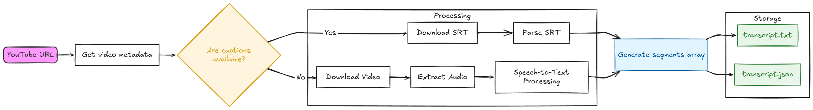

## YouTube Transcript Pipeline

A Python CLI tool that generates transcripts from YouTube videos. The application first attempts to fetch existing captions. If captions are unavailable, it downloads the video, extracts the audio using FFmpeg, and transcribes it locally using faster-whisper

### workflow
The pipeline begins by taking a YouTube URL and fetching the video's metadata to determine whether captions are available. If captions exist, the SRT subtitle file is downloaded and parsed. Otherwise, the video is downloaded, its audio is extracted, and a speech-to-text model is used to generate the transcript. Regardless of the path taken, the transcript is normalized into a structured segments array, where each segment contains the text along with its corresponding timestamps. Finally, the processed transcript is stored in both plain text (transcript.txt) and structured JSON (transcript.json) formats for downstream processing and retrieval.

### Tech stack

- python
- ffmpeg
- faster_whisper
- yt-dlp
